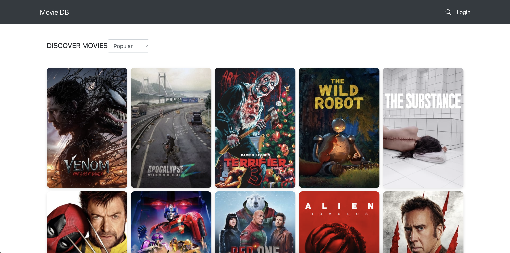
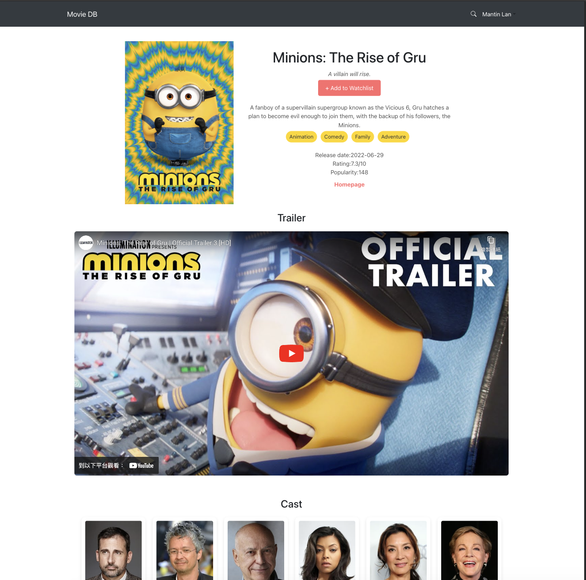
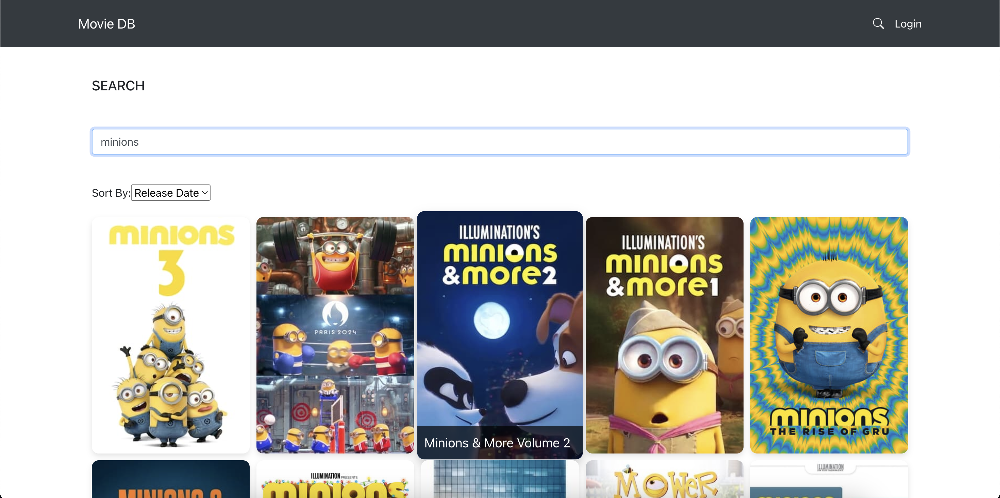
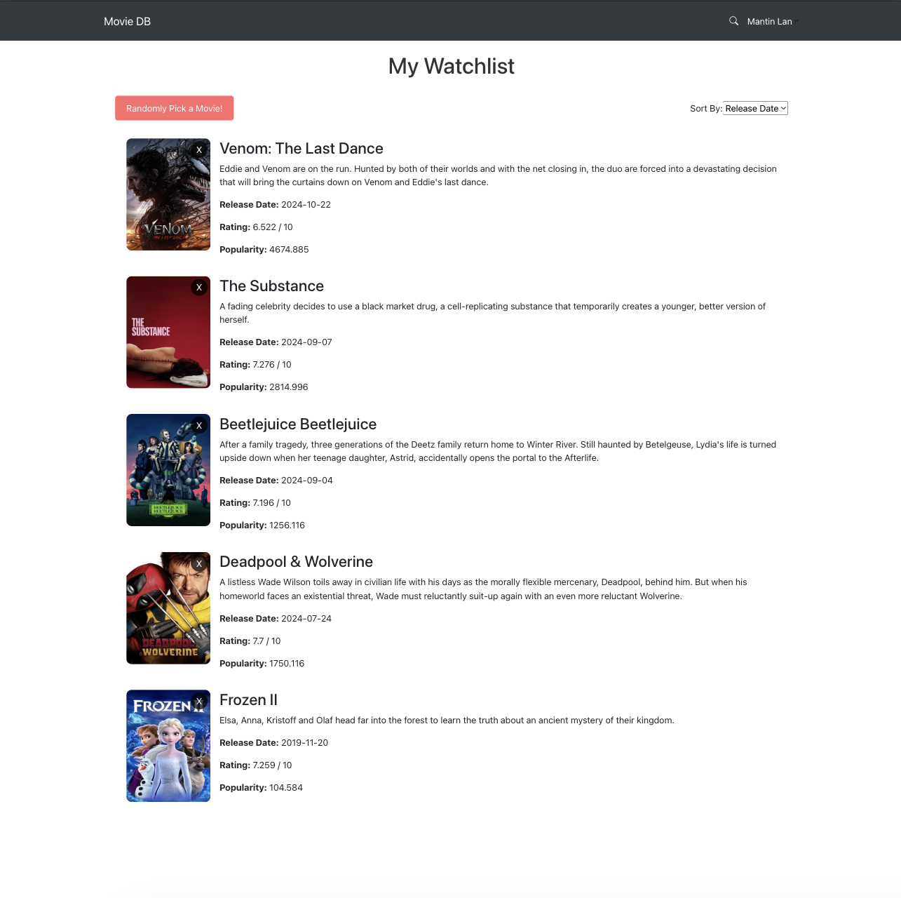

# Movie App 🎬

## Overview

A React-based movie browsing application that enables users to:
- Explore popular movies
- Search for movie information
- View detailed content (ratings, release dates, etc.)
- Sign in with Google account to manage personal watchlists

The application integrates:
- TMDB API for movie data
- Firebase for user authentication and data storage
- Features like infinite scroll, movie details, and user reviews
- Responsive design for optimal viewing across all devices

## Showcase

### Movie List Page
> Browse popular movies with infinite scroll

### Movie Detail Page
> View comprehensive movie information
 

### Search Results
> Find movies by title

### Watchlist Page
> Manage your saved movies

## Key Features

### User Features
- Google account sign in/out
- Personal watchlist management
- Secure user data storage

### Movie Browsing
- Popular/top-rated movies listing
- Movie search functionality
- Sort by date/popularity/rating
- Infinite scroll loading

### Movie Details
- Basic info (overview/release date/rating/genres)
- User reviews

### UI Optimization
- Responsive design
- Lazy image loading

## Tech Stack

- React
- React Router
- Bootstrap
- TMDB API
- Firebase

## Live Demo

🔗 [Try it now](https://mantinglan.github.io/movie-app/#/watchlist)

## Resources

📚 Documentation:
- [React](https://reactjs.org/docs)
- [TMDB API](https://developers.themoviedb.org/3)
- [Firebase](https://firebase.google.com/docs)
- [React Router](https://reactrouter.com/)
